# Tensorflow进阶

我感觉好像没听到？也没课程文件

# 卷积网络/循环网络

## 网络构成

### 人工神经元

- 单个人工神经元（Artificial Neuron）：
    - 一组输入的线性加权叠加
    - 经过一个非线性变换进行输出

### 调节权重（Weights）

### 多层人工神经网络（Multilayer neural networks）

- 单个神经元可以进行线性分类，而多个神经元的组合就可以完成复杂的分类工作
- 多层神经网络，又称为深度神经网络，在实际中表现出更好的性能
- 多层人工神经网络的层间连接关系
    - 按照连接主义观点：人工神经网络由大量的神经元以及它们之间的有向连接构成，能够实现复杂的智能功能
    - 网络的拓扑结构：不同层神经元之间的连接关系
        - 前馈网络（feedforward）
        - 反馈网络（feedback）
        - 记忆网络（memory network) 
    - 图网络

### 人工神经网络工作原理

- 人工神经网络方法是机器学习中的监督学习方法（supervise learning）
- 监督学习的训练数据集（data set）
    - 样本（sample）上都有相应的标签（label），用来指导训练过程
- 监督学习过程分为训练和推断两阶段

#### 人工神经网络的训练与推断

- 训练： 
    - 目标：网络输出与预期输出（即标签）之间差异的度量函数，取得最小值（或极小值） 
    - 过程：输入训练数据（样本）到人工神经网络，调整的每层的内部权重参数（梯度下降法等优化方法） 
    - 固化（frozen）：固定每层内部权重模型参数，形成统一的模型参数网络 
- 推断：
    - 用训练集上得到模型参数，对训练数据集外的数据推断（预测）其可能的标签

#### 模型参数

- 模型参数：
    - 网络的层数等结构
    - 每层的权重参数
    - 输入与输出端
- 模型文件查看工具netron
    - [https://github.com/lutzroeder/netron](https://github.com/lutzroeder/netron)
    - [https://lutzroeder.github.io/netron/](https://lutzroeder.github.io/netron/)(在线版)

## 卷积网络

- 权重共享（Parameters sharing）和池化（pooling）操作
    - 利用了波形或图像信息的局部和谐性（ local coherence），学习其中的不变量特征（ invariant features）
- 卷积网络的基本的结构（a series of stages of the form）：
    - Convolution/bias/non-linearity activation (ReLU or sigmoid functions)/pooling 
    - 有时需要添加进去正则化层（Normalization layers），如LCN(local contrast normalization) 
    - LCN操作在最大池化层之后，其目标是减去平均值，除以标准差。LCN操作具有亮度不变性的特点，对于图像识别用处很大

## 循环网络

- 循环网络（Recurrent neural network，简称RNN）
- 在时间维度上，每一个时间步处理时，采用共享的权重
- 用于序列建模预测问题：
    - 手写识别（handwriting recognition）、语音识别（speech recognition） 
    - 诗歌填词（poem compose）、代码生成（code writing） 
    - 股价预测（stock price）、天气预测（weather forecast）
    - 机器翻译（machine translation）、图片注释（image caption） 
    - ......
-  [The Unreasonable Effectiveness of Recurrent Neural Networks](http://karpathy.github.io/2015/05/21/rnn-effectiveness/)

### 循环网络结构

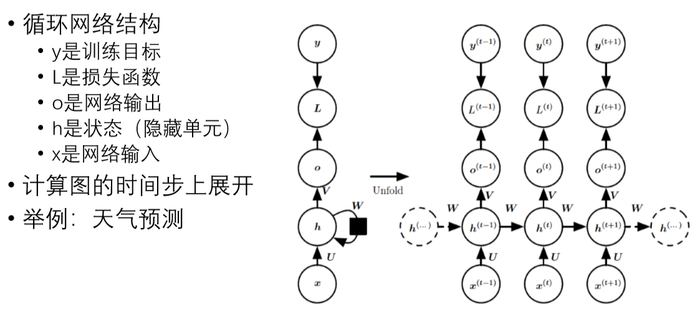

#### 权重共享

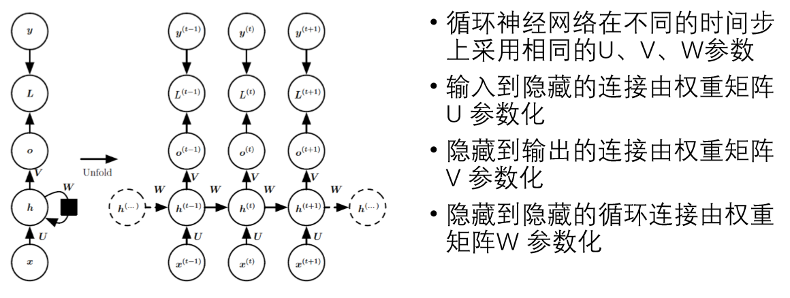

#### RNN计算图

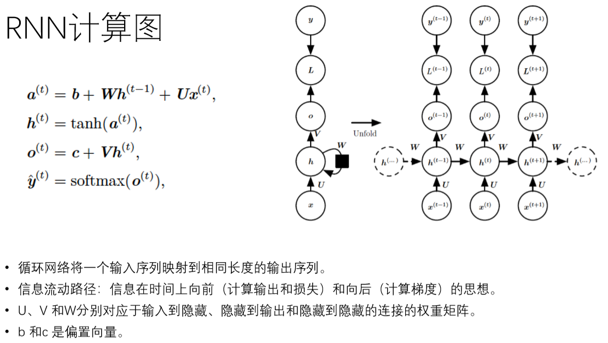

#### 输入与可变输出

啥玩意儿没看懂

### 双向RNN

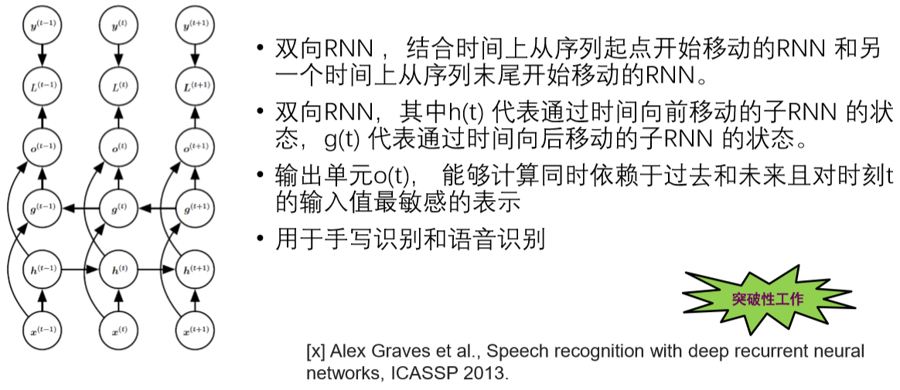
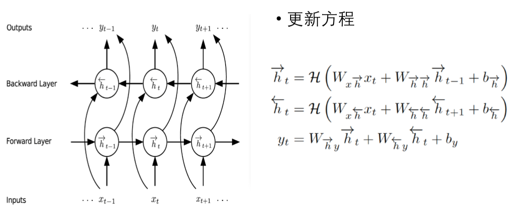

### 计算成本

- 通过时间反向传播算法（back-propagation through time, BPTT）应用于展开图的反向传播参数调节
- 梯度计算涉及执行一次前向传播（从左到右的传播），一次由右到左的反向传播
- 运行时间是O(T)，并且不能通过并行化来降低，因为前向传播图是固有顺序的
- 每个时间步只能一前一后地计算。前向传播中的各个状态必须保存，直到它们反向传播中被再次使用，因此内存代价也是O(T)
- 损失函数的梯度关于各个参数的计算是计算成本很高的操作
- 由此可见，循环网络非常强大但训练代价也很大

### RNN训练的其他问题

- Gradient Clipping
    - 训练循环网络时，经常出现梯度要么太大，要么太小，为了加速训练，需要把梯度设置为一些固定数值。比如说，梯度的任何维度的数值应该小于1，如果某个维度的数值大于1，则固定设置为1. 
- 训练RNN时的梯度消失和梯度爆炸问题 
    - BPTT时，最初和最后的时间步的梯度的 幅度过大或者过小
    - Sigmoid函数的饱和问题
    - ReLU函数的问题 
- LSTM解决以上问题

### 长短时记忆网络（Long-short term memory ）

- LSTM是RNN的一个改进，LSTM增加了一个主输入单元和其他三个辅助的门限输入单元： 
    - 记忆单元（memory cell）、输入门（input gate）、遗忘门（forget gate）及输出门（output gate）
- 三个辅助输入分别控制网络是否输入，是否存储输入以及是否输出
    - 输入门（Input gate）控制是否输入，遗忘门（Forget gate）控制是否存储，输出门（Output gate）控制是否输出
- 辅助单元可以寄存时间序列的输入，在训练过程中会利用后向传播的方式进行
- 记忆单元和这些门单元的组合，大大提升了RNN处理远距离依赖问题的能力 ，解决RNN网络收敛慢的问题。

#### 门电路

#### 组成结构

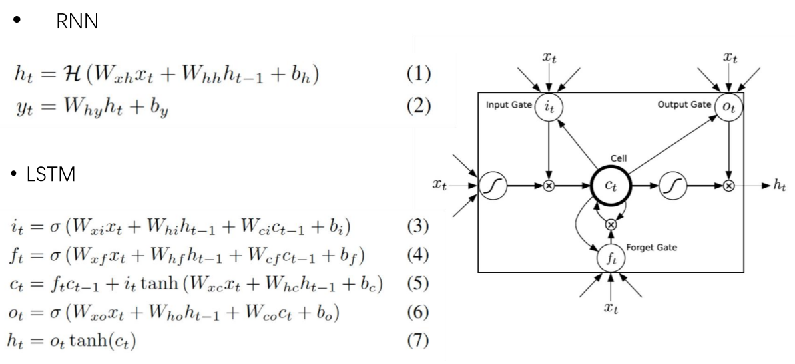

### 门控循环单元（Gated Recurrent Unit ）

- GRU （Gated Recurrent Unit）是Cho等提出的LSTM的简化版本，也是RNN的一种变种
- GRU单元只有两个门： 
    - 更新门（update gate），将LSTM的输入门和遗忘门合并，用于控制历史信息对当前时刻隐层输出的影响。如果更新门接近1，会把历史信息传递下去。 
    - 重置门（reset gate），如果重置门关闭，会忽略掉历史信息，即历史不相干的信息不会影响未来的输出。

### 循环网络的近似能力

- Schäfer 和Zimmermann的论文证明（ICANN-2006）：
    - 用Sigmoid激活函数的RNN是图灵完备的（Turing-complete），即只要给出 正确的权重，RNNs可以计算任何可计算的程序
- RNN是图灵完全等价的(Siegelmann and Sontag, 1995):
    - 任何图灵可计算的函数都可以通过一个有限维的循环网络计算
    - RNN 经过若干时间步后读取输出，这与由图灵机所用的时间步是渐近线性的，与输入长度也是渐近线性

## 序列对序列模型（Sequence-to-Sequence Models）

- 序列对序列模型Seq2Seq是一个万能模型
- 注意力机制（attention mechanism）

## 神经图灵机（Neural Turing Machines）

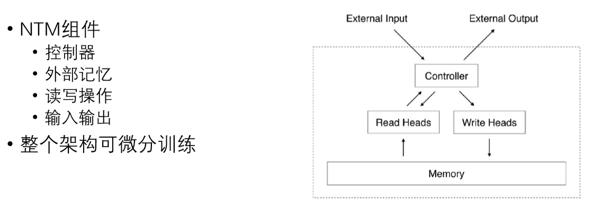

## Differentiable neural computers (DNC)

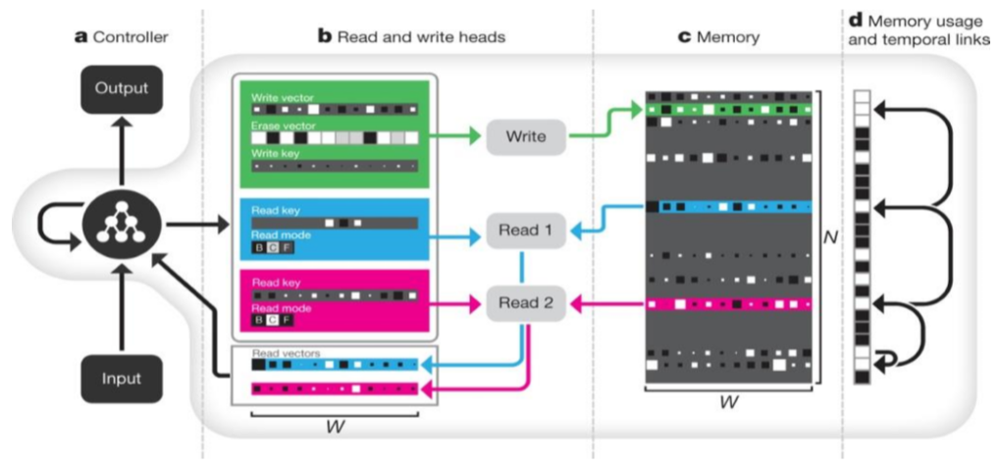

# 语音识别ASR

## 语音信号探究

- 语音信号是声波
- 信号的表示
    - 波形图（Waveform）
    - 频率图（Frequency）
    - 时频谱（Spectrogram）

### 波形图

- 语音信号是时变信号

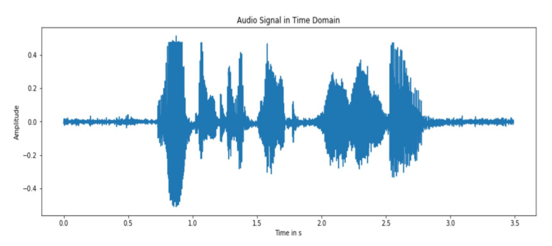

### 频域图

- FFT（快速傅立叶变换）

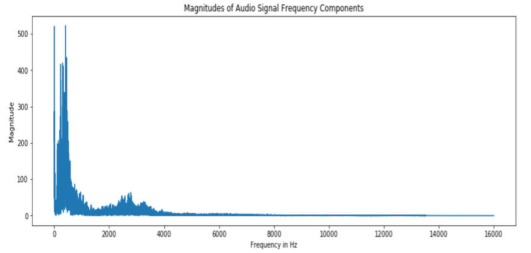

### 时频谱

- 将波形文件通过STFFT变换
- 优点：保留了时间与频域的信息

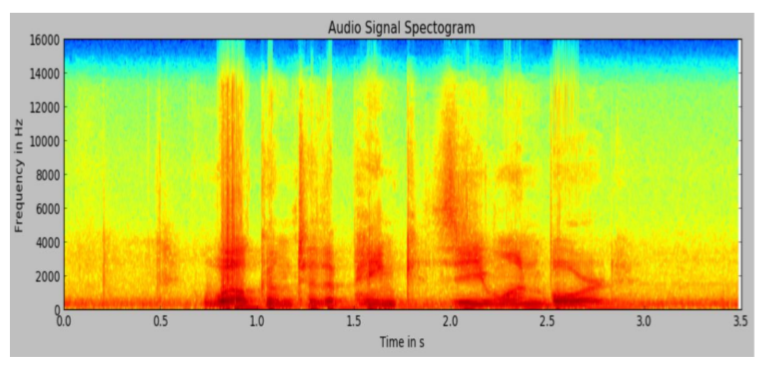

## 语音识别的本质

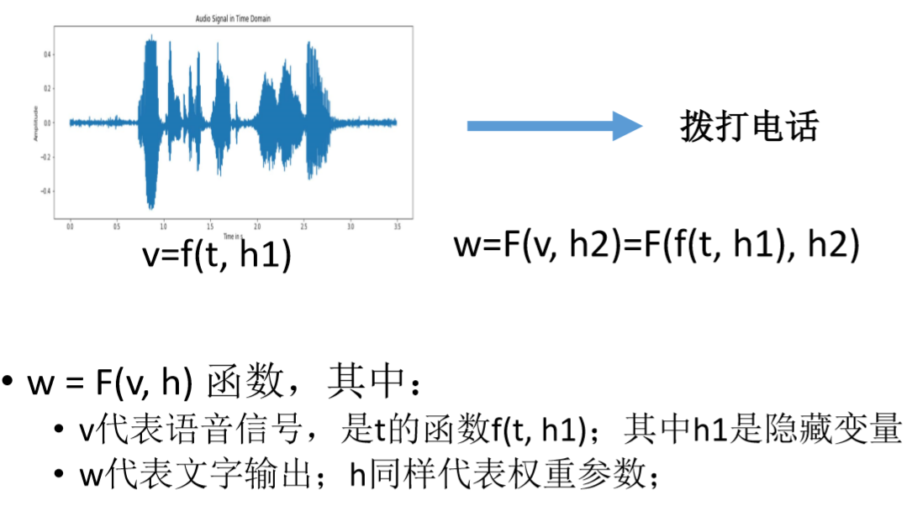

## 深度学习方法

- 端到端语音识别流水线由三个主要部分组成：特征提取、声学 模型、语言模型
    1. 将原始音频信号（如 wav 文件）作为输入，并产生特征向量序列，给定音频输入帧的特征向量。特征提取的输出示例包括原始波形、频谱图和时频谱图
    2. 将特征向量序列作为输入，并产生以特征向量输入为条件的字符或音素序列的概率的声学模型
    3. 采用两个输入（声学模型的输出以及语言模型）的解码器，在受到语言模型中编码的语言规则约束的声学模型生成的不同序列，搜索其中最可能的转录

# AudioRec

# 语音识别实践
