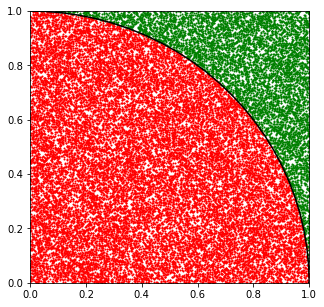

<h1>Table of Contents<span class="tocSkip"></span></h1>
<div class="toc"><ul class="toc-item"><li><span><a href="#环境" data-toc-modified-id="环境-1"><span class="toc-item-num">1&nbsp;&nbsp;</span>环境</a></span><ul class="toc-item"><li><span><a href="#Jupyter" data-toc-modified-id="Jupyter-1.1"><span class="toc-item-num">1.1&nbsp;&nbsp;</span>Jupyter</a></span><ul class="toc-item"><li><span><a href="#安装Anaconda" data-toc-modified-id="安装Anaconda-1.1.1"><span class="toc-item-num">1.1.1&nbsp;&nbsp;</span>安装Anaconda</a></span></li><li><span><a href="#添加清华镜像源" data-toc-modified-id="添加清华镜像源-1.1.2"><span class="toc-item-num">1.1.2&nbsp;&nbsp;</span>添加清华镜像源</a></span></li><li><span><a href="#更新所有库" data-toc-modified-id="更新所有库-1.1.3"><span class="toc-item-num">1.1.3&nbsp;&nbsp;</span>更新所有库</a></span></li><li><span><a href="#启用jupyter-nbextensions" data-toc-modified-id="启用jupyter-nbextensions-1.1.4"><span class="toc-item-num">1.1.4&nbsp;&nbsp;</span>启用jupyter nbextensions</a></span></li><li><span><a href="#修改Jupyter默认目录和浏览器" data-toc-modified-id="修改Jupyter默认目录和浏览器-1.1.5"><span class="toc-item-num">1.1.5&nbsp;&nbsp;</span>修改Jupyter默认目录和浏览器</a></span></li><li><span><a href="#安装和启用nbextensions扩展" data-toc-modified-id="安装和启用nbextensions扩展-1.1.6"><span class="toc-item-num">1.1.6&nbsp;&nbsp;</span>安装和启用nbextensions扩展</a></span></li><li><span><a href="#Anaconda清理" data-toc-modified-id="Anaconda清理-1.1.7"><span class="toc-item-num">1.1.7&nbsp;&nbsp;</span>Anaconda清理</a></span></li></ul></li><li><span><a href="#Git" data-toc-modified-id="Git-1.2"><span class="toc-item-num">1.2&nbsp;&nbsp;</span>Git</a></span></li><li><span><a href="#Haskell" data-toc-modified-id="Haskell-1.3"><span class="toc-item-num">1.3&nbsp;&nbsp;</span>Haskell</a></span></li></ul></li><li><span><a href="#知识——圆周率算法" data-toc-modified-id="知识——圆周率算法-2"><span class="toc-item-num">2&nbsp;&nbsp;</span>知识——圆周率算法</a></span><ul class="toc-item"><li><span><a href="#Monte-Carlo" data-toc-modified-id="Monte-Carlo-2.1"><span class="toc-item-num">2.1&nbsp;&nbsp;</span>Monte Carlo</a></span><ul class="toc-item"><li><span><a href="#原理" data-toc-modified-id="原理-2.1.1"><span class="toc-item-num">2.1.1&nbsp;&nbsp;</span>原理</a></span></li><li><span><a href="#代码实现" data-toc-modified-id="代码实现-2.1.2"><span class="toc-item-num">2.1.2&nbsp;&nbsp;</span>代码实现</a></span></li><li><span><a href="#示例" data-toc-modified-id="示例-2.1.3"><span class="toc-item-num">2.1.3&nbsp;&nbsp;</span>示例</a></span></li><li><span><a href="#启发" data-toc-modified-id="启发-2.1.4"><span class="toc-item-num">2.1.4&nbsp;&nbsp;</span>启发</a></span></li></ul></li><li><span><a href="#Taylor-Series" data-toc-modified-id="Taylor-Series-2.2"><span class="toc-item-num">2.2&nbsp;&nbsp;</span>Taylor Series</a></span><ul class="toc-item"><li><span><a href="#原理" data-toc-modified-id="原理-2.2.1"><span class="toc-item-num">2.2.1&nbsp;&nbsp;</span>原理</a></span></li><li><span><a href="#代码实现" data-toc-modified-id="代码实现-2.2.2"><span class="toc-item-num">2.2.2&nbsp;&nbsp;</span>代码实现</a></span></li><li><span><a href="#示例" data-toc-modified-id="示例-2.2.3"><span class="toc-item-num">2.2.3&nbsp;&nbsp;</span>示例</a></span></li><li><span><a href="#启发" data-toc-modified-id="启发-2.2.4"><span class="toc-item-num">2.2.4&nbsp;&nbsp;</span>启发</a></span></li></ul></li><li><span><a href="#Chudnovsky" data-toc-modified-id="Chudnovsky-2.3"><span class="toc-item-num">2.3&nbsp;&nbsp;</span>Chudnovsky</a></span><ul class="toc-item"><li><span><a href="#原理" data-toc-modified-id="原理-2.3.1"><span class="toc-item-num">2.3.1&nbsp;&nbsp;</span>原理</a></span></li><li><span><a href="#代码实现" data-toc-modified-id="代码实现-2.3.2"><span class="toc-item-num">2.3.2&nbsp;&nbsp;</span>代码实现</a></span></li><li><span><a href="#示例" data-toc-modified-id="示例-2.3.3"><span class="toc-item-num">2.3.3&nbsp;&nbsp;</span>示例</a></span></li><li><span><a href="#启发" data-toc-modified-id="启发-2.3.4"><span class="toc-item-num">2.3.4&nbsp;&nbsp;</span>启发</a></span></li><li><span><a href="#改进（不一定" data-toc-modified-id="改进（不一定-2.3.5"><span class="toc-item-num">2.3.5&nbsp;&nbsp;</span>改进（不一定</a></span></li></ul></li><li><span><a href="#Iterative" data-toc-modified-id="Iterative-2.4"><span class="toc-item-num">2.4&nbsp;&nbsp;</span>Iterative</a></span><ul class="toc-item"><li><span><a href="#原理" data-toc-modified-id="原理-2.4.1"><span class="toc-item-num">2.4.1&nbsp;&nbsp;</span>原理</a></span></li><li><span><a href="#代码实现" data-toc-modified-id="代码实现-2.4.2"><span class="toc-item-num">2.4.2&nbsp;&nbsp;</span>代码实现</a></span></li><li><span><a href="#示例" data-toc-modified-id="示例-2.4.3"><span class="toc-item-num">2.4.3&nbsp;&nbsp;</span>示例</a></span></li><li><span><a href="#启发" data-toc-modified-id="启发-2.4.4"><span class="toc-item-num">2.4.4&nbsp;&nbsp;</span>启发</a></span></li></ul></li></ul></li></ul></div>
# 环境

## Jupyter

我个人使用Anaconda配置Jupyter

### 安装Anaconda

到[Anaconda](https://www.anaconda.com/distribution/)下载Anaconda针对Win的Python3.7发行版，按照正常步骤安装

**注意**：安装到英文目录， **不要** 勾选把Anaconda加入系统path

### 添加清华镜像源

**注意** 今后对Anaconda环境的命令都需要在Anaconda Prompt（之后简称终端）中 **以管理员身份** 执行，避免污染python环境！

在终端中执行以下命令，在conda安装包路径中添加清华镜像，可以大大提升各类包的安装速度

```
conda config --add channels https://mirrors.tuna.tsinghua.edu.cn/anaconda/pkgs/free/
conda config --add channels https://mirrors.tuna.tsinghua.edu.cn/anaconda/pkgs/main/
conda config --add channels https://mirrors.tuna.tsinghua.edu.cn/anaconda/cloud/conda-forge/
conda config --add channels https://mirrors.tuna.tsinghua.edu.cn/anaconda/cloud/msys2/
conda config --add channels https://mirrors.tuna.tsinghua.edu.cn/anaconda/cloud/bioconda/
conda config --add channels https://mirrors.tuna.tsinghua.edu.cn/anaconda/cloud/menpo/
conda config --add channels https://mirrors.tuna.tsinghua.edu.cn/anaconda/cloud/pytorch/
conda config --add channels https://mirrors.tuna.tsinghua.edu.cn/anaconda/cloud/peterjc123/
conda config --set show_channel_urls yes
```

使用`conda info`可以看到已有的channels

### 更新所有库

1. 在终端中执行`conda upgrade pip`，更新`pip`

2. 在终端中执行`conda update --all`，更新所有库

3. 在终端中执行`conda install -c conda-forge jupyter_contrib_nbextensions`，安装jupyter_nbextensions

    *（如果下载太慢也可以开VPN用`pip install jupyter_contrib_nbextensions`）*

### 启用jupyter nbextensions

1. 在终端中执行`jupyter nbextensions_configurator enable --system`，使nbextensions生效

2. 然后执行`jupyter contrib nbextension install --system`

3. 然后执行`jupyter contrib nbextension install --sys-prefix`

### 修改Jupyter默认目录和浏览器

1. 首先找到Jupyter的快捷方式，右键-属性-目标中删除“%Userprofile%

2. 打开终端，输入`jupyter notebook --generate-config`，在对应的文件夹中找到jupyter_notebook_config.py

3. 文本打开jupyter_notebook_config.py，查询找到"c.NotebookApp.notebook_dir ="这个字符串，将它前面的“#”号去掉，等号后面赋值默认工作目录，保存退出；注意 **规避字符常量，比如\0是空字符常量，如果文件夹名称形如“01_APP”，则\要改为\\**

4. Jupyter使用系统默认浏览器，所以打开win10默认应用，修改默认浏览器即可

### 安装和启用nbextensions扩展

1. 使用`conda install autopep8`或开VPN使用`pip install autopep8`安装`autopep8`

2. 打开jupyter，在`edit`-`nbextensions config`中启用（个人习惯）`(some) LaTeX environments for Jupyter`,`Collapsible Headings`,`contrib_nbextensions_help_item`,`Equation Auto Numbering`,`Hide input`,`Nbextensions edit menu item`,`Python Markdown`,`Table of Contents (2)`,`Variable Inspector`,`2to3 Converter`,`Autopep8`,`Codefolding`,`Gist-it`,`jupyter-js-widgets/extension`,`Live Markdown Preview`,`Move selected cells`,`Nbextensions dashboard tab`,`Split Cells Notebook`

### Anaconda清理

`conda clean --all`删除所有安装包文件

## Git

不是很熟悉Git，用的桌面版Github Desktop
1. 到[Github Desktop](https://desktop.github.com/)下载并安装Github Desktop
2. 登录账号，clone仓库，有更新时pull和push，暂存待定更新不要直接commit到master上……
3. 安装[MathJax Plugin for Github
](https://chrome.google.com/webstore/detail/mathjax-plugin-for-github/ioemnmodlmafdkllaclgeombjnmnbima?h1=zh)（要科学上网）可以在Github上看到LaTeX代码的数学公式

## Haskell

到[Haskell](https://www.haskell.org/downloads/)划到最下面下载Platform版本，正常安装就整挺好

# 知识——圆周率算法

## Monte Carlo

### 原理

大数定理思想，频率估计概率

### 代码实现


```python
import random
import math


def draw(inner_points, outer_points):
    import matplotlib.pyplot as plt
    %matplotlib inline
    fig, ax = plt.subplots(figsize=(5, 5))
    inner_x = [x[0] for x in inner_points]
    inner_y = [x[1] for x in inner_points]
    outer_x = [x[0] for x in outer_points]
    outer_y = [x[1] for x in outer_points]
    ax.scatter(inner_x, inner_y, color="r", s=1)
    ax.scatter(outer_x, outer_y, color="g", s=1)

    ax.set_xlim(0, 1)
    ax.set_ylim(0, 1)

    import numpy as np
    theta = np.linspace(0, 2*np.pi, 100)
    r = 1
    x1 = r*np.cos(theta)
    x2 = r*np.sin(theta)
    ax.plot(x1, x2, color='black')
    plt.show()


def MonPi(number):
    N2 = number
    N1 = 0.
    inner_points = []
    outer_points = []
    for i in range(N2):
        x = random.random()
        y = random.random()
        if x*x+y*y <= 1:
            N1 += 1
            inner_points.append([x, y])
        else:
            outer_points.append([x, y])

    print("Monte PI:", 4*N1/N2)
    draw(inner_points, outer_points)
```

### 示例


```python
MonPi(30000)
```

    Monte PI: 3.1490666666666667





### 启发

1. 用不同的color标记内外点
2. 用三角函数画弧
3. draw和calc函数分开写

## Taylor Series

### 原理

对于反正切函数的泰勒级数展开：

$$
\arctan (x)=\sum_{k=0}^{\infty}(-1)^{k} \frac{x^{2 k+1}}{2 k+1}=x-\frac{1}{3} x^{3}+\frac{1}{5} x^{5}-\frac{1}{7} x^{7}+\cdots
$$

当$x=1$时，$\arctan (x)=\pi/4$，即有：

$$
\frac{\pi}{4}=\sum_{n=0}^{\infty} \frac{(-1)^{n}}{2 n+1}
$$

### 代码实现


```python
def TaylorPi(k):
    sum, odd = 0, True
    for i in range(1, k):
        sum += 1/(2*i-1) if odd == True else -1/(2*i-1)
        odd = not odd
    print("Taylor PI:", sum*4)
```

### 示例


```python
TaylorPi(1000000)
```

    Taylor PI: 3.1415936535907742


### 启发

1. 使用odd这个布尔变量来辅助判断简化代码

## Chudnovsky

### 原理

Chundnovsky公式：

$$
\pi=\frac{426880 \sqrt{10005}}{\sum_{k=0}^{\infty} \frac{(6 k) !(13591409+545140134 k)}{(3 k) !(k !)^{3}(-640320)^{3 k}}}
$$

[公式证明](https://en.wikipedia.org/wiki/Chudnovsky_algorithm)

### 代码实现


```python
def Ch_cal(k):
    uper_value = math.factorial(6*k)*(13591409+545140134*k)
    lower_value = math.factorial(3*k)*math.pow(math.factorial(k),3)*math.pow((-640320),3*k)
    return uper_value/lower_value

def Chudnovsky(number):
    uper_value = 426880*math.sqrt(10005)
    lower_sum = 0.
    for k in range(number):
        lower_sum+=Ch_cal(k)
    print("Chudnovsky PI:",uper_value/lower_sum)
```

### 示例


```python
Chudnovsky(10)
```

    Chudnovsky PI: 3.141592653589793


```python
def Ch_cal(k):
    uper_value = math.factorial(6*k)*(13591409+545140134*k)
    lower_value = math.factorial(3*k)*math.pow(math.factorial(k),3)*math.pow((-640320),3*k)
    return uper_value/lower_value

def Chudnovsky(number):
    uper_value = 426880*math.sqrt(10005)
    lower_sum = 0.
    for k in range(number):
        lower_sum+=Ch_cal(k)
    print("Chudnovsky PI:",uper_value/lower_sum)
```

### 启发

1. 观察公式，只计算变动的分母部分，并分为上下部分分开计算

### 改进（不一定

当$k$值增加的时候，$k$的阶乘也会迅速飙升，再进行幂指操作很容易超出`math`函数的计算限，例如：


```python
Chudnovsky(20)
```


    ---------------------------------------------------------------------------
    
    OverflowError                             Traceback (most recent call last)
    
    <ipython-input-8-62b9c5c50958> in <module>
    ----> 1 Chudnovsky(20)


    <ipython-input-7-54d71762bb50> in Chudnovsky(number)
          8     lower_sum = 0.
          9     for k in range(number):
    ---> 10         lower_sum+=Ch_cal(k)
         11     print("Chudnovsky PI:",uper_value/lower_sum)


    <ipython-input-7-54d71762bb50> in Ch_cal(k)
          1 def Ch_cal(k):
          2     uper_value = math.factorial(6*k)*(13591409+545140134*k)
    ----> 3     lower_value = math.factorial(3*k)*math.pow(math.factorial(k),3)*math.pow((-640320),3*k)
          4     return uper_value/lower_value
          5 


    OverflowError: math range error


但Python本身对于数字是没有长度限制的，所以幂指操作我们没必要用`math.pow`函数来做，这样可以进一步扩大我们的计算范围：


```python
def Ch_cal_new(k):
    uper_value = math.factorial(6*k)*(13591409+545140134*k)
    lower_value = math.factorial(3*k)*((math.factorial(k))**3)*((-640320)**(3*k))
    return uper_value/lower_value

def Chudnovsky_new(number):
    uper_value = 426880*math.sqrt(10005)
    lower_sum = 0.
    for k in range(number):
        lower_sum+=Ch_cal_new(k)
    print("Chudnovsky PI:",uper_value/lower_sum)
```


```python
Chudnovsky_new(20)
```

    Chudnovsky PI: 3.141592653589793


因为这个公式收敛得很快，所以这种操作可能对计算精度提高没有多少实质性作用（如果设置多显示几位小数应该可以看到差别吧），但谁让我们内存大呢

## Iterative

### 原理

[高斯-勒让德算法](https://zh.wikipedia.org/wiki/高斯-勒让德算法)

### 代码实现


```python
def Iterative_cal(number):
    a_now = 1.
    b_now = 1./math.sqrt(2)
    t_now = .25
    p_now = 1.
    for i in range(number):
        a = (a_now+b_now)/2
        b = math.sqrt(a_now*b_now)
        t = t_now-p_now*math.pow((a_now-a),2)
        p = 2*p_now

        a_now = a
        b_now = b
        t_now = t
        p_now = p
    print("Iterative PI:",math.pow(a_now+b_now,2)/(4*t_now))
```

### 示例


```python
Iterative_cal(100)
```

    Iterative PI: 3.141592653589794


### 启发

1. 用数字后带点的形式`1.`来告诉Python这是浮点数
